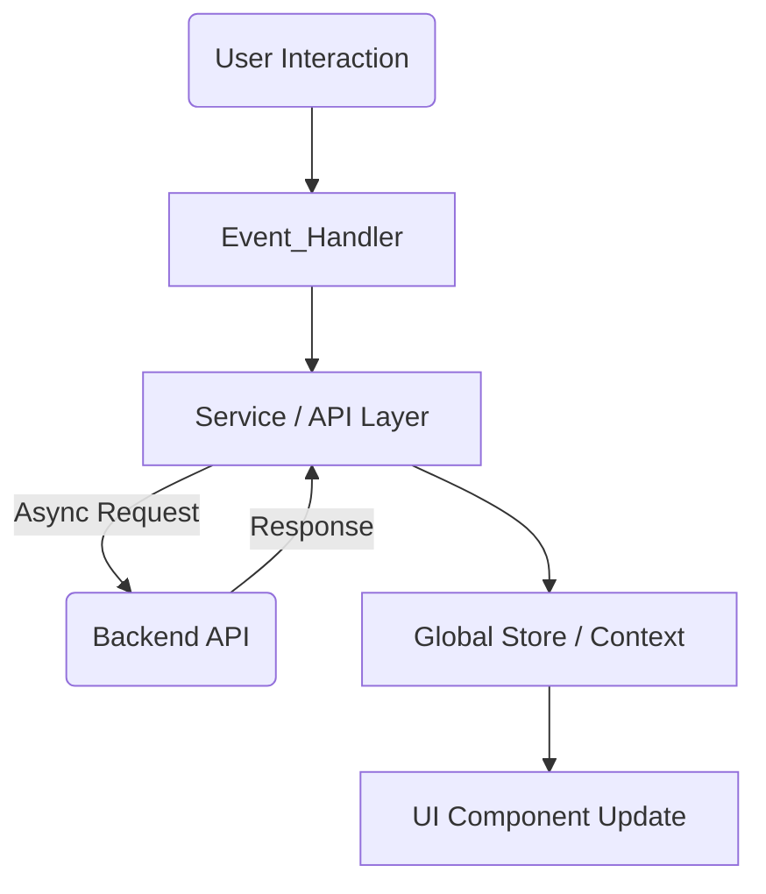

# Architecture Guide: lendsqr-fe-test

This document provides a high-level overview of the architectural decisions, design patterns, and structure of the **lendsqr-fe-test** repository. It is intended to guide reviewers and contributors through the codebase's logical organization and flow.

## 🏗 High-Level Overview

This project is a **Single Page Application (SPA)** built using **TypeScript**. The architecture focuses on modularity, scalability, and separation of concerns, ensuring that business logic is decoupled from UI presentation.

### Key Goals
1.  **Maintainability:** Clear separation between data fetching, state management, and UI rendering.
2.  **Scalability:** Feature-based folder structure to allow the application to grow without clutter.
3.  **Performance:** Optimized bundle sizes and efficient re-rendering strategies.
4.  **Type Safety:** Strict TypeScript configuration to catch errors at compile time.

---

## 🛠 Tech Stack

*   **Core:** TypeScript, [e.g., React / Vue / Next.js]
*   **Build Tool:** [e.g., Vite / Webpack]
*   **State Management:** [e.g., Redux Toolkit / Context API / Zustand]
*   **Styling:** [e.g., SCSS / Tailwind CSS / Styled Components]
*   **Testing:** [e.g., Vitest / Jest / React Testing Library]
*   **HTTP Client:** [e.g., Axios / Fetch API]

---

## 📂 Project Structure

The project follows a **Feature-Based Architecture** (or Domain-Driven Design lite). Instead of grouping by file type (e.g., putting all controllers together), we group by feature.

```text
lendsqr-fe-test/
├── public/              # Static assets (images, fonts, favicon)
├── src/
│   ├── assets/          # Global assets imports (SCSS mixins, shared SVGs)
│   ├── components/      # Shared/dumb UI components (Buttons, Inputs)
│   │   ├── Button/
│   │   │   ├── Button.tsx
│   │   │   ├── Button.styles.ts
│   │   │   └── Button.test.ts
│   ├── config/          # Environment variables and configuration setup
│   ├── context/         # Global state context (if applicable)
│   ├── hooks/           # Custom reusable hooks (e.g., useFetch, useForm)
│   ├── layouts/         # Layout wrappers (DashboardLayout, AuthLayout)
│   ├── pages/           # Page-level components (Route definitions)
│   │   ├── Dashboard/
│   │   ├── Login/
│   │   └── UserDetails/
│   ├── services/        # API integration and protocols
│   │   ├── api.ts       # Axios instance setup
│   │   └── auth.ts      # Auth-specific endpoints
│   ├── styles/          # Global styles, variables, and resets
│   ├── types/           # Shared TypeScript interfaces and enums
│   ├── utils/           # Helper functions (date formatting, validation)
│   ├── App.tsx          # Root component
│   └── main.tsx         # Entry point
├── tests/               # End-to-end tests (Playwright/Cypress)
├── .env                 # Environment variables
├── .eslintrc.json       # Linter configuration
├── tsconfig.json        # TypeScript configuration
└── README.md
```

---

## 🔄 Data Flow & State Management

The application utilizes a **unidirectional data flow**.



### Strategy
1.  **Server State:** Handled via [e.g., React Query / SWR / Custom Hooks]. We treat remote data as asynchronous state that needs caching and invalidation strategies.
2.  **Client State:** Handled via [e.g., Context API / Redux]. This manages ephemeral UI state (modals open/close, theme toggles).
3.  **Local State:** `useState` is used for component-specific logic that does not need to be shared.

---

## 🧩 Key Architectural Decisions

### 1. Separation of Container and Presentational Components
*   **Presentational Components:** Found in `src/components`. These are pure functional components concerned only with *how things look*. They receive data via props and emit events via callbacks.
*   **Container Components:** Found in `src/pages` or `src/features`. These are concerned with *how things work*. They handle state, fetch data, and pass it down to presentational components.

### 2. Service Layer Pattern
Direct API calls are not made inside components. Instead, we use a Service Layer (`src/services`).
*   **Benefit:** Allows easy mocking of API calls for testing.
*   **Benefit:** Centralized error handling and interceptors (e.g., attaching Bearer tokens).

### 3. Styling Strategy
We utilize [Methodology, e.g., SCSS Modules / Utility Classes] to prevent style leakage.
*   **Variables:** Colors, typography, and spacing are defined in global variables/tokens to ensure consistency with the Lendsqr brand guidelines.
*   **Responsiveness:** Mobile-first approach is enforced.

---

## 🛡️ Error Handling & Validation

*   **API Errors:** A centralized interceptor catches 4xx and 5xx errors to display toast notifications or redirect users (e.g., 401 Unauthorized -> Login).
*   **Form Validation:** Implemented using [e.g., React Hook Form + Zod/Yup] for schema-based validation, ensuring clean and type-safe user inputs.
*   **Error Boundaries:** React Error Boundaries wrap the main application to catch runtime crashes and display a fallback UI.

---

## 🧪 Testing Strategy

1.  **Unit Testing:** Focuses on shared utility functions and hooks.
2.  **Component Testing:** Verifies that UI components render correctly based on props (using Testing Library).
3.  **Integration Testing:** Ensures that pages interact correctly with the mocked service layer.

Run tests via:
```bash
npm run test
```

---

## 🚀 CI/CD & Deployment

*   **Linting:** Pre-commit hooks (Husky) ensure code quality before commits.
*   **Build:** The project is bundled using [Vite/Webpack] for production optimization (minification, tree-shaking).
*   **Deployment:** Configured for deployment on [Vercel/Netlify/GitHub Pages].

---

## 🔮 Future Improvements

*   **Internationalization (i18n):** Setup structure for multi-language support.
*   **Accessibility (a11y):** Further auditing to ensure WCAG 2.1 AA compliance.
*   **Performance:** Implementation of code-splitting and lazy loading for heavy routes.